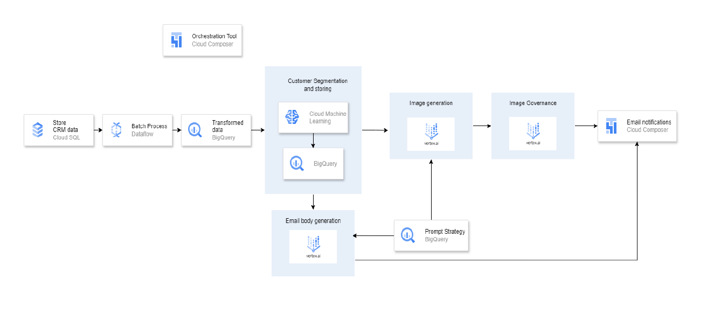

# 🎯 Hyper-Personalized Advertisement Generation using Generative AI

## 🧠 Overview

Traditional advertisements often adopt a one-size-fits-all approach, which fails to resonate with diverse customer segments. Our project addresses this by leveraging **Generative AI on Google Cloud Vertex AI** to automate the creation of personalized marketing assets — especially ad creatives tailored to individual personas.

Imagine marketing an ice cream differently to a child, a fitness enthusiast, and a retiree — all automatically, without hiring an entire creative team.

This framework allows businesses to:
- Dynamically generate visuals for different customer personas
- Extract meaning from those visuals for governance or personalization validation
- Store outputs in scalable, auditable storage
- Envision a full-text-based generation system for personalized emails *(future roadmap)*

---

## 🚀 Solution Features

1. **🎨 Hyper-personalized Image Generation**  
   Creates unique ad creatives per customer using **Vertex AI Image Generation** based on the customer persona.

2. **🧠 Visual Understanding of Ad Creatives**  
   Performs **Visual Question Answering (VQA)** on generated images using **Gemini Pro Vision** to validate content realism, style, and thematic alignment.

3. **🔐 Data Governance & Privacy**  
   Ensures that all customer data used in the pipeline adheres to governance standards by leveraging secure GCP-native services like BigQuery and Cloud Storage.

4. **📏 Image Governance Enforcement**  
   Validates whether generated content complies with branding or creative guidelines (e.g., ensuring no offensive or non-compliant visuals are generated).

---

## 📸 Example Use Case

**Business Scenario**: A travel company wants to promote a Kashmir tour package to different customer profiles.

### Profile 1: Bachelor male (25–30), adventurous  
**Subject**: *Embark on the Adventure of a Lifetime in Kashmir!*  
Creative includes images of snow treks, kayaking, and rugged landscapes.

### Profile 2: Married man (25–30), spiritual  
**Subject**: *Discover Spiritual Serenity in Kashmir — A Journey for Two Souls*  
Creative shows serene gardens, mosques, and peaceful lake views for couples.

Each customer receives a unique ad creative and personalized messaging aligning with their lifestyle and values.

---

## ⚙️ Architecture (Current + Scalable Vision)

# 🎯 Hyper-Personalized Advertisement Generation using Generative AI

## 🧠 Overview

Traditional advertisements often adopt a one-size-fits-all approach, which fails to resonate with diverse customer segments. Our project addresses this by leveraging **Generative AI on Google Cloud Vertex AI** to automate the creation of personalized marketing assets — especially ad creatives tailored to individual personas.

Imagine marketing an ice cream differently to a child, a fitness enthusiast, and a retiree — all automatically, without hiring an entire creative team.

This framework allows businesses to:
- Dynamically generate visuals for different customer personas
- Extract meaning from those visuals for governance or personalization validation
- Store outputs in scalable, auditable storage
- Envision a full-text-based generation system for personalized emails *(future roadmap)*

---

## 🚀 Solution Features

1. **🎨 Hyper-personalized Image Generation**  
   Creates unique ad creatives per customer using **Vertex AI Image Generation** based on the customer persona.

2. **🧠 Visual Understanding of Ad Creatives**  
   Performs **Visual Question Answering (VQA)** on generated images using **Gemini Pro Vision** to validate content realism, style, and thematic alignment.

3. **🔐 Data Governance & Privacy**  
   Ensures that all customer data used in the pipeline adheres to governance standards by leveraging secure GCP-native services like BigQuery and Cloud Storage.

4. **📏 Image Governance Enforcement**  
   Validates whether generated content complies with branding or creative guidelines (e.g., ensuring no offensive or non-compliant visuals are generated).

---

## 📸 Example Use Case

**Business Scenario**: A travel company wants to promote a Kashmir tour package to different customer profiles.

### Profile 1: Bachelor male (25–30), adventurous  
**Subject**: *Embark on the Adventure of a Lifetime in Kashmir!*  
Creative includes images of snow treks, kayaking, and rugged landscapes.

### Profile 2: Married man (25–30), spiritual  
**Subject**: *Discover Spiritual Serenity in Kashmir — A Journey for Two Souls*  
Creative shows serene gardens, mosques, and peaceful lake views for couples.

Each customer receives a unique ad creative and personalized messaging aligning with their lifestyle and values.

---

## ⚙️ Architecture (Current + Scalable Vision)
# 🎯 Hyper-Personalized Advertisement Generation using Generative AI

## 🧠 Overview

Traditional advertisements often adopt a one-size-fits-all approach, which fails to resonate with diverse customer segments. Our project addresses this by leveraging **Generative AI on Google Cloud Vertex AI** to automate the creation of personalized marketing assets — especially ad creatives tailored to individual personas.

Imagine marketing an ice cream differently to a child, a fitness enthusiast, and a retiree — all automatically, without hiring an entire creative team.

This framework allows businesses to:
- Dynamically generate visuals for different customer personas
- Extract meaning from those visuals for governance or personalization validation
- Store outputs in scalable, auditable storage
- Envision a full-text-based generation system for personalized emails *(future roadmap)*

---

## 🚀 Solution Features

1. **🎨 Hyper-personalized Image Generation**  
   Creates unique ad creatives per customer using **Vertex AI Image Generation** based on the customer persona.

2. **🧠 Visual Understanding of Ad Creatives**  
   Performs **Visual Question Answering (VQA)** on generated images using **Gemini Pro Vision** to validate content realism, style, and thematic alignment.

3. **🔐 Data Governance & Privacy**  
   Ensures that all customer data used in the pipeline adheres to governance standards by leveraging secure GCP-native services like BigQuery and Cloud Storage.

4. **📏 Image Governance Enforcement**  
   Validates whether generated content complies with branding or creative guidelines (e.g., ensuring no offensive or non-compliant visuals are generated).

---

## 📸 Example Use Case

**Business Scenario**: A travel company wants to promote a Kashmir tour package to different customer profiles.

### Profile 1: Bachelor male (25–30), adventurous  
**Subject**: *Embark on the Adventure of a Lifetime in Kashmir!*  
Creative includes images of snow treks, kayaking, and rugged landscapes.

### Profile 2: Married man (25–30), spiritual  
**Subject**: *Discover Spiritual Serenity in Kashmir — A Journey for Two Souls*  
Creative shows serene gardens, mosques, and peaceful lake views for couples.

Each customer receives a unique ad creative and personalized messaging aligning with their lifestyle and values.

---

## ⚙️ Architecture (Current + Scalable Vision)




> 💡 **Scalability Potential**:  
> This modular architecture can be extended to handle millions of profiles by integrating **Dataflow** for streaming personas and **Cloud Composer** for orchestration. **Text generation (e.g., emails, push messages)** can be layered using **Gemini Pro text models**.

---

## 🛠️ Tech Stack (Planned Architecture)

| Component                        | Usage                                                   |
|----------------------------------|----------------------------------------------------------|
| **Cloud SQL**                    | Structured customer profile storage                     |
| **Dataflow**                     | Data ingestion and transformation at scale              |
| **BigQuery**                     | Customer prompt, image metadata, and VQA logging        |
| **Vertex AI (Text/Image)**       | Persona-based ad generation                             |
| **Cloud Storage**                | Scalable image hosting and retrieval                    |
| **Gemini Pro Vision**            | Visual QA & content validation                          |
| **Cloud Composer**               | Workflow orchestration across modules                   |

---

## 🧱 Current Implementation Status

- ✅ Persona-based **prompt ingestion** using BigQuery  
- ✅ Image generation using **Vertex AI's ImageGenerationModel**  
- ✅ Image upload to **Google Cloud Storage**  
- ✅ Visual QA via **Gemini Pro Vision**  
- ✅ Result logging in **BigQuery**  
- ⏳ Email generation and full orchestration via Composer – *Planned*

---

## 🧪 Scripts Overview

| Script                    | Description                                                                |
|---------------------------|----------------------------------------------------------------------------|
| `generate_customer_images.py` | Generates images based on customer prompts and stores them in GCS         |
| `image_vqa_analysis.py`      | Analyzes generated images using Gemini Vision and stores insights in BQ |
| `generate_customer_personas.py` | *(Placeholder)* For generating text personas *(to be integrated)*         |

---

## 📈 Future Enhancements

- Full pipeline orchestration with **Cloud Composer**
- **Text-to-email** generation integration
- Integration with **marketing platforms** (e.g., Mailchimp, Salesforce) via APIs
- Governance dashboards for image validation and campaign insights

---

## 🧩 How to Run

1. Ensure the following GCP services are enabled:
   - Vertex AI API
   - BigQuery
   - Cloud Storage
   - IAM roles for Vertex AI and BigQuery access

2. Update the following in your scripts:
   - `project_id`
   - `dataset_id`
   - GCS bucket name

3. Execute scripts in order:
   ```bash
   python generate_customer_images.py
   python image_vqa_analysis.py
